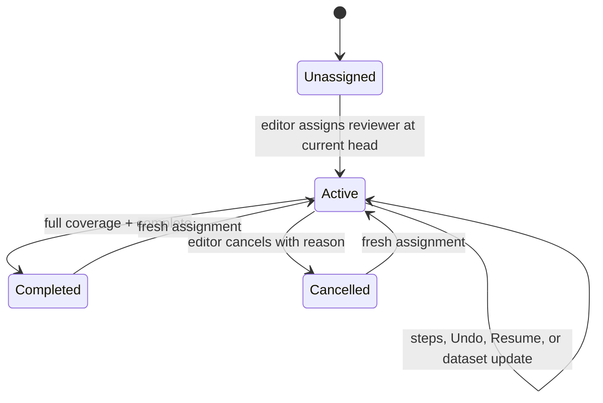

# Multi-User Movement Review Design

Status: implementation contract
Last updated: 2026-08-06

## Purpose

This document defines authentication, authorization, assignment, review coverage,
editor coordination, dataset-update behavior, and live state updates for the full
`movement` app and the user-facing `slim_movement` app.

The design is intentionally small-team oriented: one application process, roughly
2–20 users, and hundreds to low thousands of studies. It adds no external database,
polling loop, merge workflow, or work to the movement map's hot data paths.

## Existing terminology remains authoritative

The core execution model does not change:

- An **analysis** is exploratory or presentational work. It persists its user,
  script, spec, summary, and outputs, but does not create a dataset node.
- A **step** is a persistent change. It always creates a new immutable dataset
  node and reuses unchanged artifacts by reference.
- A **study** is the project directory and its complete lineage.
- A **dataset** is one immutable version node in that lineage.
- The **current dataset** is the study's active head.

A review is assigned to the whole study. Its baseline is the current dataset at
assignment time, and the review follows the active lineage through later steps,
Undo, Resume, editor work, enrichment, and explicit dataset updates.

Steps may carry optional review-specific metadata. This metadata does not create
a new kind of execution and does not weaken any step invariant:

```json
{
  "workflow": {
    "review_id": "review_...",
    "review_effect": "annotation_only",
    "review_impact": {
      "scope": "none",
      "added_individuals": [],
      "changed_individuals": [],
      "removed_individuals": []
    }
  }
}
```

Review effects are:

- `annotation_only`: review annotations and individual decisions.
- `preserves_individual_scope`: persistent enrichment which does not change
  which individuals need review.
- `changes_individual_scope`: an update to movement records that may add,
  change, or remove individuals.

Analyses do not receive a step classification. Reports, exports, rankings,
candidate previews, and feature-space projections remain analyses.

## Roles and privileges

There are two application roles. Account administration remains an operator task.

| Capability | Reviewer | Editor |
| --- | --- | --- |
| Log in, inspect identity, log out | Yes | Yes |
| List/open active assigned studies | Yes | All studies |
| Open previous assigned reviews | Read-only | Yes |
| Navigate versions in an assigned review | Yes | Yes |
| Save annotations and individual decisions | Active assignment | Yes |
| Run approved analyses, reports, exports, saved queries | Active assignment | Yes |
| Complete a fully covered review | Own review | Yes, audited |
| Undo within the active review | Yes, not before baseline | Yes |
| Resume from an earlier version | Own review steps only | Yes |
| Assign, cancel, or reassign | No | Yes |
| Take, release, or recover editor control | No | Yes |
| Apply movement dataset updates | No | Yes |
| Create reusable candidate-query definitions | No | Yes |
| Manage accounts in the web UI | No | No |

Reviewers may view all versions on their assigned review's lineage. Viewing a
historical version is read-only. They may Undo no earlier than the review baseline.
They may Resume only when every discarded forward step belongs to the current
review, is reviewer-authored, and does not change individual scope. Forward editor
steps, dataset updates, prior-review steps, and pre-assignment history require an
editor.

“Candidate-query definitions” means the app's reusable saved candidate selectors
(numeric, string, or spatial proximity checks). Some selectors can use OSM context,
but this is not permission to edit raw OSM/Overpass requests. Reviewers may run
approved saved definitions; only editors may create or revise the reusable library.

## Authentication and actor attribution

Operator-managed users live at `data/.vibecleaning/users.json`. The file contains
stable user IDs, normalized usernames, display names, roles, enabled state,
authentication versions, and salted scrypt password hashes. A CLI bootstraps the
first editor and adds, lists, enables, disables, or resets users. Changes take
effect after application restart, so normal requests never read the account file.

Login creates a cryptographically random opaque session in process memory. The
browser receives only a session token in an `HttpOnly`, `SameSite=Strict` cookie.
Sessions disappear on process restart. Unsafe cookie-authenticated requests must
be same-origin. Production HTTPS deployments set the cookie's `Secure` flag.

The request body is not an identity source. At the HTTP boundary, any supplied
`user`, `actor`, or workflow actor fields are overwritten with the authenticated
actor. Existing `user` strings remain for compatibility; a structured snapshot is
also persisted:

```json
{
  "user": "Taylor Reviewer",
  "actor": {
    "user_id": "user_...",
    "username": "treviewer",
    "display_name": "Taylor Reviewer",
    "role": "reviewer"
  },
  "review_id": "review_..."
}
```

The actor snapshot is written to steps, analyses, execution specs, output dataset
manifests, movement annotations, review events, update impacts, and background
jobs. Authorization always uses the stable authenticated user ID, never the
display-name snapshot.

## Review state and lifecycle

Each study stores a versioned `.vibecleaning/reviews.json`. It contains review
history, the active review, editor-control state, and an append-only workflow-event
log. Writes are atomic and occur while holding the same per-study mutation lock
used for head changes.

A review contains:

- stable review ID plus a file-level monotonically increasing workflow revision;
- `active`, `completed`, or `cancelled` status;
- assigned reviewer ID and identity snapshot;
- assigning actor and assignment time;
- baseline, current, and final dataset IDs;
- the initial required individual set (current scope is derived by replaying update impacts);
- completion and cancellation actors, timestamps, and reasons;
- dataset-update impact events on the active lineage.

Only one review may be active. Assignment starts at the current dataset head and
creates fresh coverage. Earlier decisions remain readable history but do not
satisfy the new assignment. Completion freezes the final head. An editor may
cancel an unfinished review with a required reason, then assign a new reviewer at
the unchanged current head.

Review state is cached by file modification time. Missing state means an existing
study is unassigned; no migration rewrites existing DAG files.



The persisted shape is intentionally compact:

```json
{
  "schema_version": 1,
  "revision": 4,
  "reviews": [{
    "review_id": "review_...",
    "status": "active",
    "reviewer_user_id": "user_...",
    "reviewer": {"user_id": "user_...", "role": "reviewer"},
    "assigned_by": {"user_id": "user_...", "role": "editor"},
    "assigned_at": "2026-08-06T12:00:00+00:00",
    "baseline_dataset_id": "dataset_...",
    "final_dataset_id": null,
    "initial_individuals": ["A", "B"]
  }],
  "editor_control": null,
  "events": []
}
```

The account registry has `schema_version: 1` and a `users` array. Each record has
`user_id`, `username`, `display_name`, `role`, `enabled`, `auth_version`, and a
password-hash object containing the scrypt parameters, salt, and digest. Plaintext
passwords and sessions are never written to either schema.

## Individual decisions and completion

Individual decisions use an enum:

- `ok`: reviewed, no problem found;
- `not_ok`: reviewed and considered problematic;
- `second_opinion`: reviewed, but another judgment is requested.

Legacy `review_ok: true` loads as `ok`; legacy `review_ok: false` loads as
`not_ok`. New annotations retain the compatibility boolean while persisting the
enum as the source of truth.

All three states count toward first-pass completion. `second_opinion` remains in a
dedicated queue, appears in reports and exports, is included in the completion
warning, and is prioritized in later review. A later decision supersedes it
without deleting its audit history.

Completion requires a valid current-review decision for every required individual.
A decision is valid only if it is on the current lineage and is newer than the
latest dataset update affecting that individual. Coverage responses expose total,
reviewed, remaining, and second-opinion counts plus the remaining IDs.

The initial individual set is obtained once at assignment by a focused,
artifact-identity-cached streaming scan of only the individual column; no movement
features or map overview are rebuilt. Completion compares small persisted/cached state and the review
annotation sidecar; it does not scan the movement CSV again.

## Dataset updates during review

An individual never appears silently. Population or record changes happen through
an explicit editor-authored step with `review_effect=changes_individual_scope`.
During an active review, the editor must own editor control.

The update action calculates its review impact while doing its normal work:

- added individuals enter the unreviewed queue;
- changed individuals require a new decision;
- removed individuals leave required coverage;
- unaffected individuals retain their decisions;
- unknown or untrusted impact reopens every required individual.

The review remains active and assigned. Impact is stored on the step, and coverage
is replayed only across the current lineage's small manifests. Undoing before an update
removes its impact; returning past it reapplies it. Ordinary review steps do no
comparison and pay no update-processing cost.

## Editor control and mutation safety

Editor control is a small persisted workflow flag, not an operating-system lock
held while a person works. It records the owner, reason, and start time and lasts
until explicit release. There is no expiry or editor heartbeat.

An editor may read any active review without control. Before a persistent change,
the editor starts control with a reason. The reviewer becomes read-only, while the
editor may work for minutes or hours and create multiple steps. Release restores
reviewer access after state/head refresh. The same editor can resume later; a
different editor can take over with a required reason. Start, release, and takeover
are audited.

```mermaid
stateDiagram-v2
    ReviewerEditing --> ReviewerReadOnly: editor starts control
    ReviewerReadOnly --> EditorWorking: editor begins persistent work
    EditorWorking --> EditorWorking: continued work; no timeout or heartbeat
    EditorWorking --> ReviewerEditing: owner releases control
    EditorWorking --> ReviewerReadOnly: another editor takes over with reason
```



Every persistent request validates, inside the project mutation lock:

- authenticated actor and role;
- active assignment;
- editor-control ownership;
- selected version editability;
- `expected_current_dataset_id`;
- `expected_review_revision`.

The expected dataset ID prevents a stale client from writing after the lineage
head advances. The expected review revision prevents a save after assignment,
completion, cancellation, or control state changes. A conflict is detected before
executing a script or creating outputs.

## Immediate state updates

The selected study opens one authenticated Server-Sent Events connection:

`GET /api/apps/movement/family/{family}/study/{study}/events`

The server emits a small event when editor control, assignment, review status,
coverage, or the dataset head changes. The event contains the reason, current
review revision, current dataset ID, and actor summary; it contains no dataset or
map data.

On an event, the frontend ignores old revisions, fetches the small edit profile,
and reloads the dataset only if the head changed. Local selections, staged
decisions, and form text are preserved. Editor-control start disables writes
immediately. Release refreshes the head and re-enables permitted actions.

On connection and reconnection the server sends the current snapshot, so no event
backlog is persisted. A transport-only SSE comment may be sent every 60 seconds to
keep reverse proxies from closing the connection; it does not inspect state.
Window-focus refresh and mutation-time revision checks remain fallbacks. There is
no application polling.

## HTTP contracts and errors

Authentication:

- `POST /api/auth/login`
- `GET /api/auth/me`
- `POST /api/auth/logout`

Review management:

- `GET /api/apps/movement/reviewers`
- `POST .../study/{study}/review/assign`
- `POST .../study/{study}/review/complete`
- `POST .../study/{study}/review/cancel`

Editor control:

- `POST .../study/{study}/editor-control/start`
- `POST .../study/{study}/editor-control/finish`
- `POST .../study/{study}/editor-control/takeover`

Live state:

- `GET .../study/{study}/events`

Catalog, load, and edit-profile responses include actor, review summary/revision,
coverage, second-opinion count, editor control, capabilities, and blockers.

Errors use:

- `401` for missing/expired authentication;
- `403` for a known study or action forbidden to the actor;
- `404` when a reviewer must not learn that an unassigned study exists;
- `409` for a stale head or review revision;
- `423` for a current lineage, assignment, or editor-control blocker.

All review/control mutations accept JSON containing
`expected_current_dataset_id` and `expected_review_revision`. Assignment also
requires `reviewer_user_id` and may name the reviewable `logical_name`.
Cancellation, control start, and takeover require `reason`; an editor completing
on behalf of a reviewer also supplies a reason. Successful responses return the
updated review state or control record. Movement edit profiles are the canonical
client snapshot and include the concurrency tokens used by the next mutation.

## Performance constraints

- Authentication is one in-memory dictionary lookup per request.
- User files are loaded only at startup.
- Review files are tiny and cached by modification time.
- Assignment performs at most one focused individual scan.
- Completion does not scan the CSV.
- Dataset impact is calculated only by dataset-update steps.
- Fix and segment issue annotations persist the guarded, server-normalized row
  ranges directly; they do not rescan or rebuild movement features for the source
  CSV.
- Threshold and categorical-level issue filters are evaluated server-side over
  every valid row in the assigned dataset, including rows not loaded or rendered
  in the browser. Raw fields use one streaming CSV pass. Derived step fields use
  a lean chronological neighbor pass without constructing map, burst, histogram,
  or report payloads. The complete matching row scope and filter definition are
  persisted together for auditability.
- There is one idle SSE connection only for the selected study.
- SSE events trigger a small profile fetch and reload data only on head changes.
- Map construction, overview generation, fix-detail loading, and filtering remain
  unchanged.

## Security and deployment

- Passwords have no minimum character-length policy. Blank passwords are rejected;
  accepted passwords are salted scrypt hashes and never logged.
- Login responses and authenticated API responses use `Cache-Control: no-store`.
- Session cookies are HTTP-only and same-site; unsafe requests require same-origin.
- HTTPS is required outside loopback deployments.
- Disabled accounts require an operator change and restart in v1.
- Review route authorization is centralized and also applied to generic project,
  dev, query-library, artifact, analysis, and background-job routes so alternate
  endpoints cannot bypass the policy.
- SSE authorization is identical to normal study-read authorization and is checked
  again on reconnect.

## Migration and rollback

Existing projects without `reviews.json` remain unassigned and their DAG is not
rewritten. Existing boolean individual decisions remain readable. Existing
`user` fields remain supported.

The old slim single Basic credential has been removed after cookie authentication
and bootstrap documentation were completed. Rollback consists of stopping the new
server and restoring the previous app version; new review/account files are
additive and do not modify raw files or invalidate existing datasets.

## Implementation checkpoints

The implementation is organized so each checkpoint remains independently
testable. Status below describes the implementation as of this document date.

0. **Authoritative design — complete.** This document is linked from the main
   README, architecture contract, and state-model contract.
1. **Identity and attribution — complete.** `app/auth.py` and `app/auth_cli.py`
   provide startup-loaded scrypt accounts, opaque cookie sessions, operator CLI,
   same-origin checks, and server-owned actor injection.
2. **Review lifecycle and decisions — complete.** `app/reviews.py` implements
   assignment history, cancellation, reassignment, coverage, completion, legacy
   booleans, and the three decision states.
3. **Central authorization and history — complete.** Movement and generic/dev
   interfaces enforce role/read policy; reviewer Undo/Resume verifies baseline,
   author, review ID, and review effect before discarding history.
4. **Editor control and guarded mutations — complete.** Control is persisted and
   indefinite; start, release, and takeover are audited. Both concurrency tokens
   are checked under the existing mutation lock before execution.
5. **Update-aware coverage — complete.** Existing steps accept optional workflow
   metadata; scope is replayed on the active lineage, unknown impact reopens all,
   and tests cover targeted add/change/remove plus Undo.
6. **Full movement UI and SSE — complete.** The shared movement frontend includes
   login, identity, study assignment status, assignment/cancel/completion actions,
   second-opinion filtering, editor control, one selected-study SSE connection,
   and focus/visibility fallback refresh.
7. **Slim movement integration — complete.** Slim uses the same frontend and
   backend systems while retaining its feature restrictions; temporary Basic
   authentication is removed.
8. **Hardening and closure — complete.** Authentication, attribution, visibility,
   fresh reassignment, concurrency, update impact, Undo, and existing regression
   tests cover the workflow. Run the full suite through `uv run` so the movement
   and OSM scientific dependencies are available.

## Non-goals

- lineage branch merging;
- unrestricted simultaneous writes;
- realtime cursors or presence;
- periodic state polling;
- expiring editor leases;
- a dedicated database or multi-worker event bus;
- in-app account administration;
- a separate approval role.

## Decision log

### 2026-08-06 — Study-level assignments

Assignments follow the whole study lineage rather than one immutable dataset node.
This matches the user workflow while retaining immutable dataset versions.

### 2026-08-06 — Explicit editor control

An optimistic-only model was rejected because it would repeatedly interrupt the
reviewer. Branch-and-merge was rejected because the current app intentionally uses
a linear active head. Explicit control prevents collisions without changing DAG
semantics.

### 2026-08-06 — No expiring lease

A renewable lease was rejected because an editor may inspect and edit for a long
time. Explicit release and audited takeover are simpler and generate no heartbeat
traffic.

### 2026-08-06 — SSE rather than polling

Focus/action refresh alone would not promptly restore a reviewer after editor
release. Polling would create repeated traffic. A one-way study event stream gives
immediate updates with negligible small-team overhead.

### 2026-08-06 — Second opinion counts as reviewed

Uncertainty is a valid first-review outcome. It satisfies coverage but stays
visible for targeted follow-up rather than blocking the entire study.

### 2026-08-06 — Review effects extend steps

A parallel `step_class` concept was rejected. `review_effect` is optional metadata
on the existing persistent step and only describes coverage consequences.

### 2026-08-06 — Dataset updates continue the review

Automatic review cancellation was rejected. An explicit update remains on the
same lineage and reopens only added or affected individuals; unknown impact safely
reopens all.

### 2026-08-06 — File-backed users and reviews

A database was rejected for the selected single-process, small-team scope. Startup-
loaded users, in-memory sessions, cached review files, and existing file locks meet
the concurrency and performance requirements with less operational weight.
